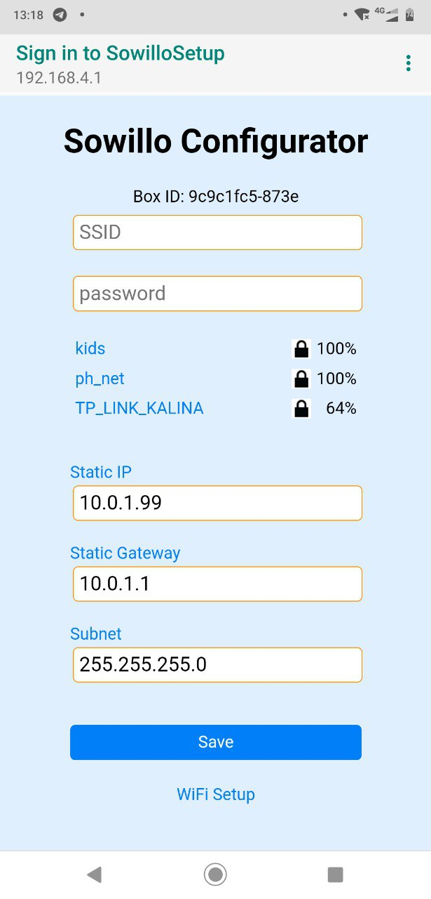

# Sowillo IoT Board WiFi Connection HOWTO

This article describes configuring Sowilo Box to be used with the user WiFi network.

Sowillo IoT board comes with a pre-flashed firmware that will connect to
a Sowillo MQTT server.

First, you need to connect your Sowillo IoT board to WiFi. This can be
done via the captive portal in a few steps:

- Wait 5 seconds after switching board to Captive Portal with Ext Button and find `"SowilloSetup"` WiFi network
- Connect to `"SowilloSetup"` without password
- Open the SignIn page from Android messages, select `"Configure WiFi"` option and wait for WiFi networks scan finished.
- Select Your WiFi network from the list enter Your Password.
    fileds `"WiFi_SSID_Name"` and `"Password"` should be filled, then save settings.

<!--  -->
