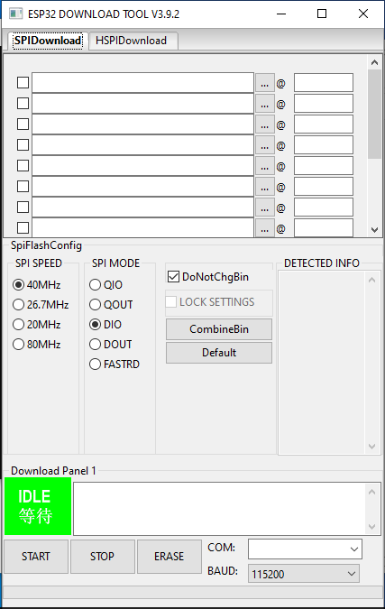
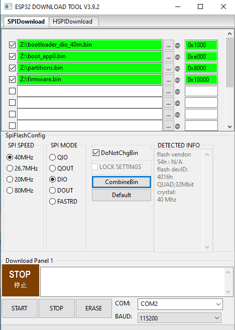

# Flashing ESP32 with pre-built firmware

## pre-requesties:

## Debian based Linux OS:

- Python 3.7 or higher
- `esptool.py`

## Windows 8, 10:

- Python 3.7 or higher
- [*Flash Download Tool*](https://www.espressif.com/en/support/download/other-tools)

# Linux way

## Flashing ESP32 first time

Provisioning of new unboxed ESP32 board require 4 binary files:

> 0x1000
> bootloader_dio_40m.bin
> 
> 0xe000
> boot_app0.bin
> 
> 0x8000
> partitions.bin
> 
> 0x10000
> firmware.bin

that should be flashed in proper addresses in flash with next command in terminal:

```bash
esptool.py --chip esp32 -p /dev/ttyUSB0 -b 921600 --before=default_reset --after=hard_reset write_flash --flash_mode dio --flash_freq 40m --flash_size 4MB 0x1000 bootloader_dio_40m.bin 0xe000 boot_app0.bin 0x8000 partitions.bin 0x10000 firmware.bin

```

## Updating previously flashed ESP32 with new firmware

if ESP32 was previously flashed with ESPHOME firmware (4 binaries),
it will be enough to issue next command in terminal:

```bash
esptool.py --chip esp32 -p /dev/ttyUSB0 -b 921600 --before=default_reset --after=hard_reset write_flash --flash_mode dio --flash_freq 40m --flash_size 4MB 0x10000 firmware.bin

```

## 

# Windows way

## [*Download*](https://www.espressif.com/en/support/download/other-tools) and install Flash Download Tool

also - have to be preinstalled [*CP210x Windows drivers*](https://www.silabs.com/documents/public/software/CP210x_Windows_Drivers.zip) on Your OS

## Run ESP32 Dwonload Tool


fill 4 binaries (unpacked from firmware archive) for 4 textboxes with correct Path to binary files,

and set flashing addresses correspondingly as shown on picture



set upload speed equal 115200 bod (recommended value)
and press Start button - terminal window will pop-up with actual info about downloading progress

its recommended fully erase flash on ESP32 SoC before flashing firmware of new project

in case You wish just update firmware - select checkbox only for flashing firmware.bin file
