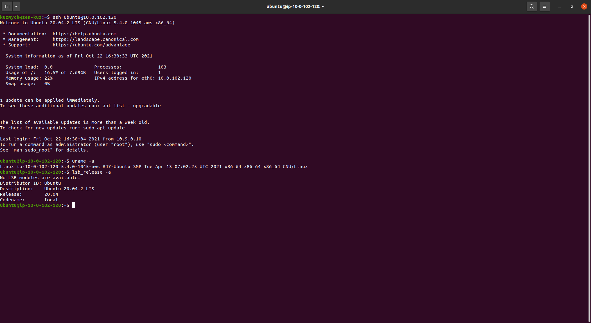

[]{#anchor}How-to guide

[]{#anchor-1}Build Sowillo firmware with patched ESPHome on Linux

This tutorial describes how to build the firmware for sowillo box on
Linux. All steps made on clean Ubuntu 20.04.

{width="6.2681in"
height="3.4307in"}

Update cache and install dependencies:

sudo apt update

sudo apt install python3 unzip python3-venv

create a separate directory for build:

mkdir build-sowillo && cd build-sowillo

Download and unzip latest patched ESPHome package::

wget \\
https://rawcontent.sowillo.com/repository/binary-files-ext/latest/esphome-patched.zip

mkdir esphome-patched && unzip esphome-patched.zip -d esphome-patched

Download and unzip latest ESPHome configurations for **Sowillo IoT
Board**:

wget \\
<https://rawcontent.sowillo.com/repository/binary-files-ext/latest/sowillo-esphome-configuration.zip>

mkdir sowillo-esphome-configuration && unzip
sowillo-esphome-configuration.zip -d sowillo-esphome-configuration

create a python virtual environment, activate it and install patched
esphome to the environment:

python3 -m venv esphome-venv

source esphome-venv/bin/activate

pip install -U pip

pip install -e esphome-patched

Build firmware:

cd sowillo-esphome-configuration

mv secrets.yaml.in secrets.yaml

Edit secrets.yaml, you may configure your default WiFi settings and MQTT
broker settings there:

nano secrets.yaml

build the firmware that you\'re interested in:

esphome compile swlbox-300.yaml
