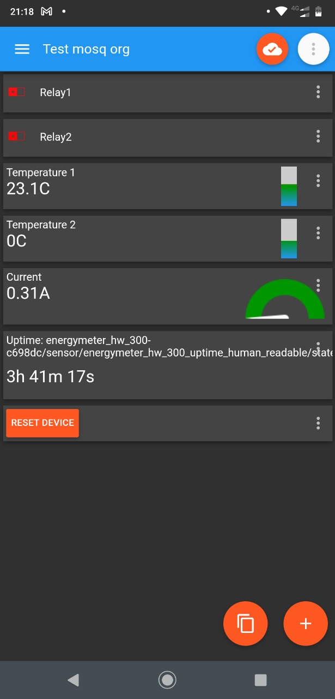
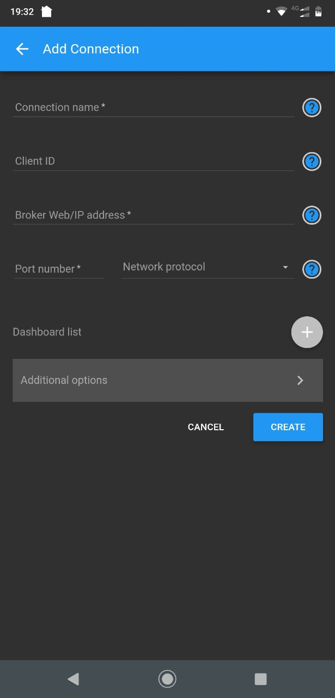
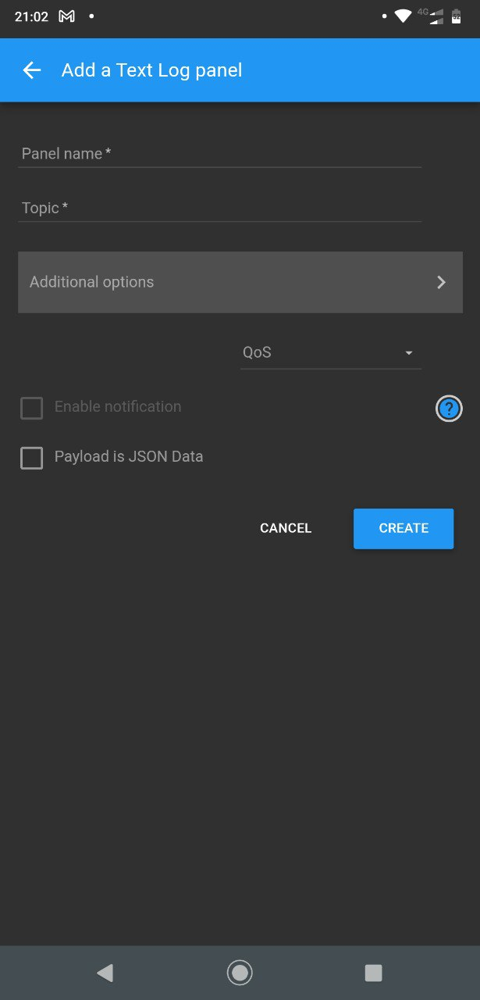
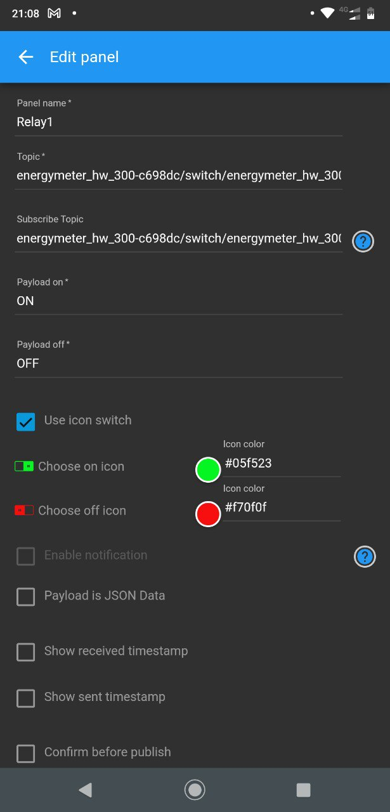
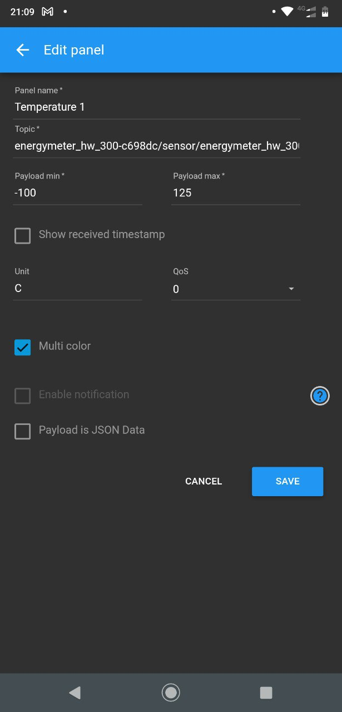
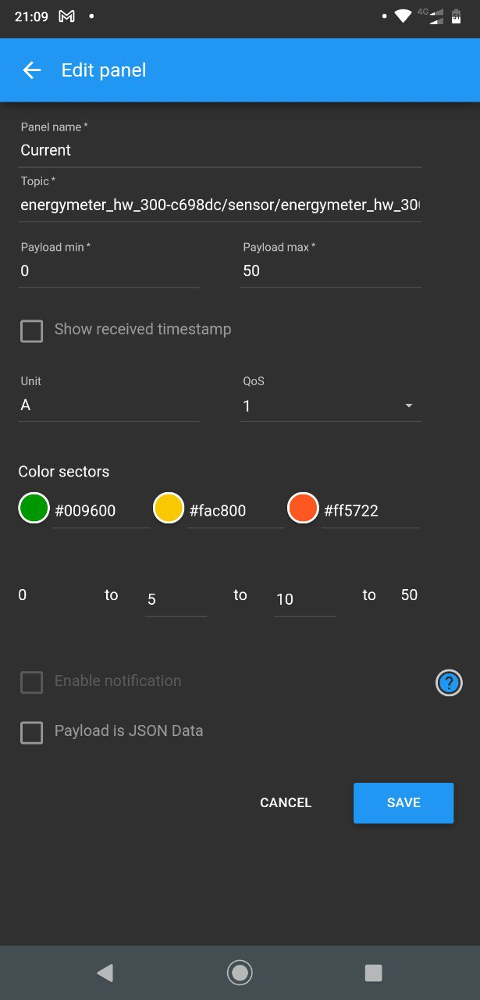
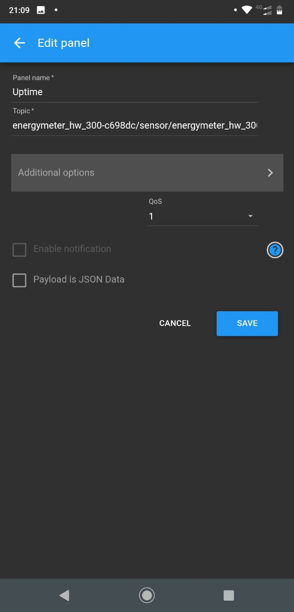

# IoT MQTT Panel for Android HOWTO

This article describes configuring Sowilo Box to be used with the IoT
MQTT Panel application with pre-built firmware over a public MQTT server
**test.mosquitto.org**.

MQTT is a standard IoT protocol for data exchange between devices. It is
very popular, lightweight, and supports publish/subscribe messaging
model. It is supported in almost every morden IoT product. You can find
more information on 
[mosquitto.org](https://mosquitto.org), 
[hivemq.com](https://www.hivemq.com/).

{
    width="1.6402px"
    height="5.4811in"
}

Sowillo IoT board comes with a pre-flashed firmware that will connect to
a public MQTT server (default: **test.mosquitto.org**). If you have
different firmware, please download and flash the binary from \<link\>
and flash as described in \<link\>. We provide several variants of
pre-build firmware for common public MQTT servers. After getting some
experience, you are advised to build your custom firmware for usage with
your custom server. Please see \<\...\> when you're ready to dive in.

First, you need to connect your Sowillo IoT board to WiFi. This can be
done via the captive portal as described \<here\>.

**Pro hint:** You may want to connect to the MQTT server
test.mosquitto.org and verify that the board sends data by monitoring
the topic:

energymeter\_hw\_300-aabbcc/sensor/energymeter\_hw\_300\_uptime\_human\_readable/state
or others described in the following section. Please, replace 'aabbcc'
with your board address which you can find on the captive portal page.

Begin by installing the
[*IoT*](https://play.google.com/store/apps/details?id=snr.lab.iotmqttpanel.prod&hl=ru&gl=US)[*
MQTT
Panel*](https://play.google.com/store/apps/details?id=snr.lab.iotmqttpanel.prod&hl=ru&gl=US)
application to your Android phone. \<QR code?\>

We used this app as an example, you can use any MQTT tool you want, just
search MQTT in Play Market/App Store.

Create a connection to public broker test.mosquitto.org and fill in the
following data:

-   **Connection name:** MyTestConnection
-   **Client ID:** MyTestClient
-   **Broker Web/IP address:** test.mosquitto.org
-   **Port number:** 1883
-   **Network protocol:** TCP

{width="3.1898in"
height="4.3484in"}

Add a new dashboard to the Dashboard list and name it TestBoard.

Then press the *Create* button.

Each example FW uses its own unique six char prefix for state and
command topics based on the last 3 bytes of the individual MAC address
ESP32 board.

For example, a unique MAC address 00:11:22:AA:BB:CC generates MQTT
topics that look like:

energymeter\_hw\_300-aabbcc/switch/energymeter\_hw\_300\_reboot/state

energymeter\_hw\_300-aabbcc/switch/energymeter\_hw\_300\_reboot/command

energymeter\_hw\_300-aabbcc/switch/energymeter\_hw\_300\_relay1/state

energymeter\_hw\_300-aabbcc/switch/energymeter\_hw\_300\_relay1/command

energymeter\_hw\_300-aabbcc/switch/energymeter\_hw\_300\_relay2/state

energymeter\_hw\_300-aabbcc/switch/energymeter\_hw\_300\_relay2/command

energymeter\_hw\_300-aabbcc/sensor/energymeter\_hw\_300\_temperature\_1/state

energymeter\_hw\_300-aabbcc/sensor/energymeter\_hw\_300\_temperature\_2/state

energymeter\_hw\_300-aabbcc/sensor/energymeter\_hw\_300\_uptime\_human\_readable/state

energymeter\_hw\_300-aabbcc/sensor/energymeter\_hw\_300\_current/state

**Note:** You can find this information in the Captive Portal.

You may want to add panels with sensor metrics, and relay controls to
the dashboard just created. You can do it as follows:

Open TestBoard and press the *AddPanel* button. Select *Text Log* and
fill the following fields:

-   **Panel Name:** Uptime
-   **Topic:
    **energymeter\_hw\_300-aabbcc/sensor/energymeter\_hw\_300\_uptime\_human\_readable/state

{width="3.5366in"
height="4.1535in"}

In addition to the *TextLog*, there are *Switch, Vertical Meter, Gauge*,
and many other panes for commonly used sensor and switch types.

Other panels could be added in a similar way:

{width="3.2138in"
height="6.6937in"}{width="3.2244in"
height="6.7193in"}

{width="3.2161in"
height="6.6925in"}{width="3.2083in"
height="6.6925in"}

The final dashboard has the following look:

{width="3.7465in"
height="7.7965in"}
